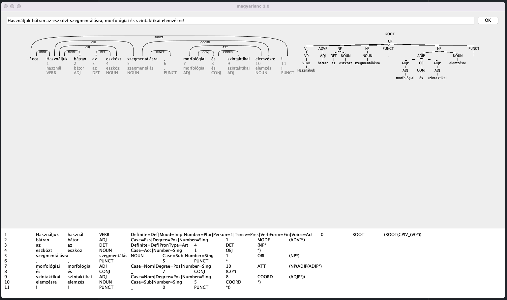
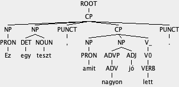
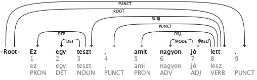

# eszterlanc 
## Clojurized access to Magyarlanc toolkit

### magyarlanc: a toolkit for linguistic processing of Hungarian

https://rgai.inf.u-szeged.hu/magyarlanc

The toolkit called magyarlanc aims at the basic linguistic processing of Hungarian texts. The toolkit consists of only JAVA modules (there are no wrappers for other programming languages), which guarantees its platform independency and its ability to be integrated into bigger systems (e.g. web servers).


This clojure library named about a poem or song titled "Lánc, lánc, eszterlánc" appears to be a traditional Hungarian children's song or (chain based) game. Just4brave people: https://www.youtube.com/watch?v=NJJLEW17oBQ.
:) 

### Reasons for creating this:
- It surpasses alternatives like Snowball, HunSpell, and StanfordNLP, which have an accuracy range of 50-70%.
- Enables seamless integration with Clojure.
- GenAI Solutions (sometimes) required Syntactic Approaches

Official commandline example:
```bash
java -Xmx2G -jar magyarlanc-3.0.jar -mode depparse -input in.txt -output out.txt -encoding ISO-8859-2
```

## Usage

[](https://clojars.org/hu.baader/eszterlanc)

Leiningen:

```angular2html
[hu.baader/eszterlanc "0.3.3"]
```

Clojure CLI/deps.edn

```angular2html
hu.baader/eszterlanc {:mvn/version "0.3.3"}
```

# initialize

On 2023-11-06, I updated the initialization script.

The script installs the MTA-SZTA Magyarlanc JAR file to the local Maven repository.
Please execute the initialization shell script to complete this process.

`./initialize`

You will find the JAR file located within the lib directory.
Add to project `mta.szta.rgai/magyarlanc` and `hu.baader/eszterlanc`.

As see in the example project:

```clojure 
(defproject eszterlanc-test "0.1.0-SNAPSHOT"
            :description "FIXME: write description"
            :url "http://example.com/FIXME"
            :license {:name "EPL-2.0 OR GPL-2.0-or-later WITH Classpath-exception-2.0"
                      :url "https://www.eclipse.org/legal/epl-2.0/"}
            :dependencies [[org.clojure/clojure "1.11.1"]
                           [hu.baader/eszterlanc "0.3.3"]
                           [mta.szte.rgai/magyarlanc "0.3.0"]]
            :repl-options {:init-ns eszterlanc-test.core})
```
### todo

- S3 Maven bucket for easier usage

## GUI

### Access to GUI

```clojure 
(require '[eszterlanc.gui :as [gui]])

(gui/init)
```


GUI namespace functions:

- [**save-image-berkley**](#save-image-berkley): on the picture, the right graph
- [**save-image-whatswrong**](#save-image-whatswrong): on the picture, the left graph
- [**save-image-to-resources**](#save-image-to-resources): save both image

## FUNCTIONS

- [**lemma-for-word**](#lemma-for-word): get a word lemma
- [**sentence-array**](#sentences-into-arrays): split strings into sentence arrays
- [**object->clj**](#helper-object-clj): helper-fn
- [**morphology**](#morphology): Morphological parser (from/via morphdb.hu) 
- [**dependency**](#dependency): Google Mate-tools Analysis adapted to Hungarian
- [**constituency**](#constituency): Berkley parser adapted to Hungarian
- [**magyarlanc**](#access-to-all-magyarlanc): Magyarlanc funcionality (all-in-one)

### Init

```clojure 
(require '[eszterlanc.core :as e])
```

### Sentences into arrays

```clojure

(def test-text
  "Két folyó találkozásánál fekszik a város, ami a várakozások ellenére nem egy oroszlánról kapta a nevét. Megmutatjuk a legjobb kocsmákat, és hogy hol lehet a legnagyobb a magyarok öröme.")

(e/sentence-array test-text)

>> #object["[[Ljava.lang.String;" 0x3c39af25 "[[Ljava.lang.String;@3c39af25"]

```
### helper: object->clj 

I added a little helper to get more readable results, if you would like to see what happens here.

```clojure
(e/object->clj 
  (sentence-array test-text))

=>
[["Két"
  "folyó"
  "találkozásánál"
  "fekszik"
  "a"
  "város"
  ","
  "ami"
  "a"
  "várakozások"
  "ellenére"
  "nem"
  "egy"
  "oroszlánról"
  "kapta"
  "a"
  "nevét"
  "."]
 ["Megmutatjuk" "a" "legjobb" "kocsmákat" "," "és" "hogy" "hol" "lehet" "a" "legnagyobb" "a" "magyarok" "öröme" "."]]

```

### Morphology


Get the morph array, about the sentences:

The morphological parser is a code based on the
finite state automata written by György Gyepesi,
which was built on the resource morphdb.hu.


```clojure
(def morph 
  (e/morph-array sentences-array))

(clojure.pprint/pprint morph)

([["Két" "két" "NUM" "Case=Nom|NumType=Card|Number=Sing"]
  ["folyó" "folyó" "NOUN" "Case=Nom|Number=Sing"]
  ["találkozásánál"
   "találkozás"
   "NOUN"
   "Case=Ade|Number=Sing|Number[psor]=Sing|Person[psor]=3"]
  ["fekszik"
   "fekszik"
   "VERB"
   "Definite=Ind|Mood=Ind|Number=Sing|Person=3|Tense=Pres|VerbForm=Fin|Voice=Act"]
  ["a" "a" "DET" "Definite=Def|PronType=Art"]
  ["város" "város" "NOUN" "Case=Nom|Number=Sing"]
  ["," "," "PUNCT" "_"]
  ["ami" "ami" "PRON" "Case=Nom|Number=Sing|Person=3|PronType=Rel"]
  ["a" "a" "DET" "Definite=Def|PronType=Art"]
  ["várakozások" "várakozás" "NOUN" "Case=Nom|Number=Plur"]
  ["ellenére" "ellenére" "ADP" "_"]
  ["nem" "nem" "ADV" "PronType=Neg"]
  ["egy" "egy" "DET" "Definite=Ind|PronType=Art"]
  ["oroszlánról" "oroszlán" "NOUN" "Case=Del|Number=Sing"]
  ["kapta"
   "kap"
   "VERB"
   "Definite=Def|Mood=Ind|Number=Sing|Person=3|Tense=Past|VerbForm=Fin|Voice=Act"]
  ["a" "a" "DET" "Definite=Def|PronType=Art"]
  ["nevét"
   "név"
   "NOUN"
   "Case=Acc|Number=Sing|Number[psor]=Sing|Person[psor]=3"]
  ["." "." "PUNCT" "_"]]
 [["Megmutatjuk"
   "megmutat"
   "VERB"
   "Definite=Def|Mood=Ind|Number=Plur|Person=1|Tense=Pres|VerbForm=Fin|Voice=Act"]
  ["a" "a" "DET" "Definite=Def|PronType=Art"]
  ["legjobb" "jó" "ADJ" "Case=Nom|Degree=Sup|Number=Sing"]
  ["kocsmákat" "kocsma" "NOUN" "Case=Acc|Number=Plur"]
  ["," "," "PUNCT" "_"]
  ["és" "és" "CONJ" "_"]
  ["hogy" "hogy" "SCONJ" "_"]
  ["hol" "hol" "ADV" "PronType=Int"]
  ["lehet"
   "lesz"
   "VERB"
   "Definite=Ind|Mood=Pot|Number=Sing|Person=3|Tense=Pres|VerbForm=Fin|Voice=Act"]
  ["a" "a" "DET" "Definite=Def|PronType=Art"]
  ["legnagyobb" "nagy" "ADJ" "Case=Nom|Degree=Sup|Number=Sing"]
  ["a" "a" "DET" "Definite=Def|PronType=Art"]
  ["magyarok" "magyar" "NOUN" "Case=Nom|Number=Plur"]
  ["öröme"
   "öröm"
   "NOUN"
   "Case=Nom|Number=Sing|Number[psor]=Sing|Person[psor]=3"]
  ["." "." "PUNCT" "_"]])
```

### Dependency

https://code.google.com/archive/p/mate-tools/
Tools for Natural Language Analysis
adapted to Hungarian
Input: array

```clojure 
(e/dependency sentences-array)
=>
([["1" "Két" "két" "NUM" "Case=Nom|NumType=Card|Number=Sing" "2" "ATT"]
  ["2" "folyó" "folyó" "NOUN" "Case=Nom|Number=Sing" "3" "ATT"]
  ["3" "találkozásánál" "találkozás" "NOUN" "Case=Ade|Number=Sing|Number[psor]=Sing|Person[psor]=3" "4" "OBL"]
  ["4"
   "fekszik"
   "fekszik"
   "VERB"
   "Definite=Ind|Mood=Ind|Number=Sing|Person=3|Tense=Pres|VerbForm=Fin|Voice=Act"
   "0"
   "ROOT"]
  ["5" "a" "a" "DET" "Definite=Def|PronType=Art" "6" "DET"]
  ["6" "város" "város" "NOUN" "Case=Nom|Number=Sing" "4" "SUBJ"]
  ["7" "," "," "PUNCT" "_" "4" "PUNCT"]
  ["8" "ami" "ami" "PRON" "Case=Nom|Number=Sing|Person=3|PronType=Rel" "15" "SUBJ"]
  ["9" "a" "a" "DET" "Definite=Def|PronType=Art" "10" "DET"]
  ["10" "várakozások" "várakozás" "NOUN" "Case=Nom|Number=Plur" "11" "ATT"]
  ["11" "ellenére" "ellenére" "ADP" "_" "15" "MODE"]
  ["12" "nem" "nem" "ADV" "PronType=Neg" "15" "NEG"]
  ["13" "egy" "egy" "DET" "Definite=Ind|PronType=Art" "14" "DET"]
  ["14" "oroszlánról" "oroszlán" "NOUN" "Case=Del|Number=Sing" "15" "OBL"]
  ["15" "kapta" "kap" "VERB" "Definite=Def|Mood=Ind|Number=Sing|Person=3|Tense=Past|VerbForm=Fin|Voice=Act" "4" "ATT"]
  ["16" "a" "a" "DET" "Definite=Def|PronType=Art" "17" "DET"]
  ["17" "nevét" "név" "NOUN" "Case=Acc|Number=Sing|Number[psor]=Sing|Person[psor]=3" "15" "OBJ"]
  ["18" "." "." "PUNCT" "_" "0" "PUNCT"]]
 [["1"
   "Megmutatjuk"
   "megmutat"
   "VERB"
   "Definite=Def|Mood=Ind|Number=Plur|Person=1|Tense=Pres|VerbForm=Fin|Voice=Act"
   "0"
   "ROOT"]
  ["2" "a" "a" "DET" "Definite=Def|PronType=Art" "4" "DET"]
  ["3" "legjobb" "jó" "ADJ" "Case=Nom|Degree=Sup|Number=Sing" "4" "ATT"]
  ["4" "kocsmákat" "kocsma" "NOUN" "Case=Acc|Number=Plur" "1" "OBJ"]
  ["5" "," "," "PUNCT" "_" "1" "PUNCT"]
  ["6" "és" "és" "CONJ" "_" "1" "CONJ"]
  ["7" "hogy" "hogy" "SCONJ" "_" "9" "CONJ"]
  ["8" "hol" "hol" "ADV" "PronType=Int" "9" "LOCY"]
  ["9" "lehet" "lesz" "VERB" "Definite=Ind|Mood=Pot|Number=Sing|Person=3|Tense=Pres|VerbForm=Fin|Voice=Act" "6" "COORD"]
  ["10" "a" "a" "DET" "Definite=Def|PronType=Art" "11" "DET"]
  ["11" "legnagyobb" "nagy" "ADJ" "Case=Nom|Degree=Sup|Number=Sing" "9" "PRED"]
  ["12" "a" "a" "DET" "Definite=Def|PronType=Art" "13" "DET"]
  ["13" "magyarok" "magyar" "NOUN" "Case=Nom|Number=Plur" "14" "ATT"]
  ["14" "öröme" "öröm" "NOUN" "Case=Nom|Number=Sing|Number[psor]=Sing|Person[psor]=3" "9" "SUBJ"]
  ["15" "." "." "PUNCT" "_" "0" "PUNCT"]])
```

### Constituency

Based on https://github.com/slavpetrov/berkeleyparser
Learning Accurate, Compact, and Interpretable Tree Annotation
adapted to Hungarian
Input: array

```clojure 
(e/constituency sentences-array)
=>
((["Két" "két" "NUM" "Case=Nom|NumType=Card|Number=Sing" "(ROOT(CP(NP(NP*"]
  ["folyó" "folyó" "NOUN" "Case=Nom|Number=Sing" "*)"]
  ["találkozásánál" "találkozás" "NOUN" "Case=Ade|Number=Sing|Number[psor]=Sing|Person[psor]=3" "*)"]
  ["fekszik"
   "fekszik"
   "VERB"
   "Definite=Ind|Mood=Ind|Number=Sing|Person=3|Tense=Pres|VerbForm=Fin|Voice=Act"
   "(V_(V0*))"]
  ["a" "a" "DET" "Definite=Def|PronType=Art" "(NP*"]
  ["város" "város" "NOUN" "Case=Nom|Number=Sing" "*)"]
  ["," "," "PUNCT" "_" "*"]
  ["ami" "ami" "PRON" "Case=Nom|Number=Sing|Person=3|PronType=Rel" "(CP(NP*)"]
  ["a" "a" "DET" "Definite=Def|PronType=Art" "(PP(NP*"]
  ["várakozások" "várakozás" "NOUN" "Case=Nom|Number=Plur" "*)"]
  ["ellenére" "ellenére" "ADP" "_" "*)"]
  ["nem" "nem" "ADV" "PronType=Neg" "(NEG*)"]
  ["egy" "egy" "DET" "Definite=Ind|PronType=Art" "(NP*"]
  ["oroszlánról" "oroszlán" "NOUN" "Case=Del|Number=Sing" "*)"]
  ["kapta" "kap" "VERB" "Definite=Def|Mood=Ind|Number=Sing|Person=3|Tense=Past|VerbForm=Fin|Voice=Act" "(V_(V0*))"]
  ["a" "a" "DET" "Definite=Def|PronType=Art" "(NP*"]
  ["nevét" "név" "NOUN" "Case=Acc|Number=Sing|Number[psor]=Sing|Person[psor]=3" "*))"]
  ["." "." "PUNCT" "_" "*))"])
 (["Megmutatjuk"
   "megmutat"
   "VERB"
   "Definite=Def|Mood=Ind|Number=Plur|Person=1|Tense=Pres|VerbForm=Fin|Voice=Act"
   "(ROOT(CP(CP(V_(V0*))"]
  ["a" "a" "DET" "Definite=Def|PronType=Art" "(NP*"]
  ["legjobb" "jó" "ADJ" "Case=Nom|Degree=Sup|Number=Sing" "(ADJP*)"]
  ["kocsmákat" "kocsma" "NOUN" "Case=Acc|Number=Plur" "*))"]
  ["," "," "PUNCT" "_" "*"]
  ["és" "és" "CONJ" "_" "(C0*)"]
  ["hogy" "hogy" "SCONJ" "_" "(C0*)"]
  ["hol" "hol" "ADV" "PronType=Int" "(CP(ADVP*)"]
  ["lehet" "lesz" "VERB" "Definite=Ind|Mood=Pot|Number=Sing|Person=3|Tense=Pres|VerbForm=Fin|Voice=Act" "(V_(V0*))"]
  ["a" "a" "DET" "Definite=Def|PronType=Art" "(NP*"]
  ["legnagyobb" "nagy" "ADJ" "Case=Nom|Degree=Sup|Number=Sing" "*)"]
  ["a" "a" "DET" "Definite=Def|PronType=Art" "(NP(NP*"]
  ["magyarok" "magyar" "NOUN" "Case=Nom|Number=Plur" "*)"]
  ["öröme" "öröm" "NOUN" "Case=Nom|Number=Sing|Number[psor]=Sing|Person[psor]=3" "*))"]
  ["." "." "PUNCT" "_" "*))"]))
```


### lemma-for-word

Why I started this project.. :)

If we give a non-real word, it still returns the original.
This can be misleading, may require further checking.
E.g. spell checking

```clojure 
(e/lemma-for-word "baglyokat")
=> "bagoly"
```

### Access to all magyarlanc

```clojure 
(e/magyarlanc sentences-array)
=>
({:morph (["Két" "két" "NUM" "Case=Nom|NumType=Card|Number=Sing"]
          ["folyó" "folyó" "NOUN" "Case=Nom|Number=Sing"]
          ["találkozásánál" "találkozás" "NOUN" "Case=Ade|Number=Sing|Number[psor]=Sing|Person[psor]=3"]
          ["fekszik" "fekszik" "VERB" "Definite=Ind|Mood=Ind|Number=Sing|Person=3|Tense=Pres|VerbForm=Fin|Voice=Act"]
          ["a" "a" "DET" "Definite=Def|PronType=Art"]
          ["város" "város" "NOUN" "Case=Nom|Number=Sing"]
          ["," "," "PUNCT" "_"]
          ["ami" "ami" "PRON" "Case=Nom|Number=Sing|Person=3|PronType=Rel"]
          ["a" "a" "DET" "Definite=Def|PronType=Art"]
          ["várakozások" "várakozás" "NOUN" "Case=Nom|Number=Plur"]
          ["ellenére" "ellenére" "ADP" "_"]
          ["nem" "nem" "ADV" "PronType=Neg"]
          ["egy" "egy" "DET" "Definite=Ind|PronType=Art"]
          ["oroszlánról" "oroszlán" "NOUN" "Case=Del|Number=Sing"]
          ["kapta" "kap" "VERB" "Definite=Def|Mood=Ind|Number=Sing|Person=3|Tense=Past|VerbForm=Fin|Voice=Act"]
          ["a" "a" "DET" "Definite=Def|PronType=Art"]
          ["nevét" "név" "NOUN" "Case=Acc|Number=Sing|Number[psor]=Sing|Person[psor]=3"]
          ["." "." "PUNCT" "_"]),
  :dep (["1" "Két" "két" "NUM" "Case=Nom|NumType=Card|Number=Sing" "2" "ATT"]
        ["2" "folyó" "folyó" "NOUN" "Case=Nom|Number=Sing" "3" "ATT"]
        ["3" "találkozásánál" "találkozás" "NOUN" "Case=Ade|Number=Sing|Number[psor]=Sing|Person[psor]=3" "4" "OBL"]
        ["4"
         "fekszik"
         "fekszik"
         "VERB"
         "Definite=Ind|Mood=Ind|Number=Sing|Person=3|Tense=Pres|VerbForm=Fin|Voice=Act"
         "0"
         "ROOT"]
        ["5" "a" "a" "DET" "Definite=Def|PronType=Art" "6" "DET"]
        ["6" "város" "város" "NOUN" "Case=Nom|Number=Sing" "4" "SUBJ"]
        ["7" "," "," "PUNCT" "_" "4" "PUNCT"]
        ["8" "ami" "ami" "PRON" "Case=Nom|Number=Sing|Person=3|PronType=Rel" "15" "SUBJ"]
        ["9" "a" "a" "DET" "Definite=Def|PronType=Art" "10" "DET"]
        ["10" "várakozások" "várakozás" "NOUN" "Case=Nom|Number=Plur" "11" "ATT"]
        ["11" "ellenére" "ellenére" "ADP" "_" "15" "MODE"]
        ["12" "nem" "nem" "ADV" "PronType=Neg" "15" "NEG"]
        ["13" "egy" "egy" "DET" "Definite=Ind|PronType=Art" "14" "DET"]
        ["14" "oroszlánról" "oroszlán" "NOUN" "Case=Del|Number=Sing" "15" "OBL"]
        ["15"
         "kapta"
         "kap"
         "VERB"
         "Definite=Def|Mood=Ind|Number=Sing|Person=3|Tense=Past|VerbForm=Fin|Voice=Act"
         "4"
         "ATT"]
        ["16" "a" "a" "DET" "Definite=Def|PronType=Art" "17" "DET"]
        ["17" "nevét" "név" "NOUN" "Case=Acc|Number=Sing|Number[psor]=Sing|Person[psor]=3" "15" "OBJ"]
        ["18" "." "." "PUNCT" "_" "0" "PUNCT"]),
  :kons (["Két" "két" "NUM" "Case=Nom|NumType=Card|Number=Sing" "(ROOT(CP(NP(NP*"]
         ["folyó" "folyó" "NOUN" "Case=Nom|Number=Sing" "*)"]
         ["találkozásánál" "találkozás" "NOUN" "Case=Ade|Number=Sing|Number[psor]=Sing|Person[psor]=3" "*)"]
         ["fekszik"
          "fekszik"
          "VERB"
          "Definite=Ind|Mood=Ind|Number=Sing|Person=3|Tense=Pres|VerbForm=Fin|Voice=Act"
          "(V_(V0*))"]
         ["a" "a" "DET" "Definite=Def|PronType=Art" "(NP*"]
         ["város" "város" "NOUN" "Case=Nom|Number=Sing" "*)"]
         ["," "," "PUNCT" "_" "*"]
         ["ami" "ami" "PRON" "Case=Nom|Number=Sing|Person=3|PronType=Rel" "(CP(NP*)"]
         ["a" "a" "DET" "Definite=Def|PronType=Art" "(PP(NP*"]
         ["várakozások" "várakozás" "NOUN" "Case=Nom|Number=Plur" "*)"]
         ["ellenére" "ellenére" "ADP" "_" "*)"]
         ["nem" "nem" "ADV" "PronType=Neg" "(NEG*)"]
         ["egy" "egy" "DET" "Definite=Ind|PronType=Art" "(NP*"]
         ["oroszlánról" "oroszlán" "NOUN" "Case=Del|Number=Sing" "*)"]
         ["kapta"
          "kap"
          "VERB"
          "Definite=Def|Mood=Ind|Number=Sing|Person=3|Tense=Past|VerbForm=Fin|Voice=Act"
          "(V_(V0*))"]
         ["a" "a" "DET" "Definite=Def|PronType=Art" "(NP*"]
         ["nevét" "név" "NOUN" "Case=Acc|Number=Sing|Number[psor]=Sing|Person[psor]=3" "*))"]
         ["." "." "PUNCT" "_" "*))"])}
 {:morph (["Megmutatjuk"
           "megmutat"
           "VERB"
           "Definite=Def|Mood=Ind|Number=Plur|Person=1|Tense=Pres|VerbForm=Fin|Voice=Act"]
          ["a" "a" "DET" "Definite=Def|PronType=Art"]
          ["legjobb" "jó" "ADJ" "Case=Nom|Degree=Sup|Number=Sing"]
          ["kocsmákat" "kocsma" "NOUN" "Case=Acc|Number=Plur"]
          ["," "," "PUNCT" "_"]
          ["és" "és" "CONJ" "_"]
          ["hogy" "hogy" "SCONJ" "_"]
          ["hol" "hol" "ADV" "PronType=Int"]
          ["lehet" "lesz" "VERB" "Definite=Ind|Mood=Pot|Number=Sing|Person=3|Tense=Pres|VerbForm=Fin|Voice=Act"]
          ["a" "a" "DET" "Definite=Def|PronType=Art"]
          ["legnagyobb" "nagy" "ADJ" "Case=Nom|Degree=Sup|Number=Sing"]
          ["a" "a" "DET" "Definite=Def|PronType=Art"]
          ["magyarok" "magyar" "NOUN" "Case=Nom|Number=Plur"]
          ["öröme" "öröm" "NOUN" "Case=Nom|Number=Sing|Number[psor]=Sing|Person[psor]=3"]
          ["." "." "PUNCT" "_"]),
  :dep (["1"
         "Megmutatjuk"
         "megmutat"
         "VERB"
         "Definite=Def|Mood=Ind|Number=Plur|Person=1|Tense=Pres|VerbForm=Fin|Voice=Act"
         "0"
         "ROOT"]
        ["2" "a" "a" "DET" "Definite=Def|PronType=Art" "4" "DET"]
        ["3" "legjobb" "jó" "ADJ" "Case=Nom|Degree=Sup|Number=Sing" "4" "ATT"]
        ["4" "kocsmákat" "kocsma" "NOUN" "Case=Acc|Number=Plur" "1" "OBJ"]
        ["5" "," "," "PUNCT" "_" "1" "PUNCT"]
        ["6" "és" "és" "CONJ" "_" "1" "CONJ"]
        ["7" "hogy" "hogy" "SCONJ" "_" "9" "CONJ"]
        ["8" "hol" "hol" "ADV" "PronType=Int" "9" "LOCY"]
        ["9"
         "lehet"
         "lesz"
         "VERB"
         "Definite=Ind|Mood=Pot|Number=Sing|Person=3|Tense=Pres|VerbForm=Fin|Voice=Act"
         "6"
         "COORD"]
        ["10" "a" "a" "DET" "Definite=Def|PronType=Art" "11" "DET"]
        ["11" "legnagyobb" "nagy" "ADJ" "Case=Nom|Degree=Sup|Number=Sing" "9" "PRED"]
        ["12" "a" "a" "DET" "Definite=Def|PronType=Art" "13" "DET"]
        ["13" "magyarok" "magyar" "NOUN" "Case=Nom|Number=Plur" "14" "ATT"]
        ["14" "öröme" "öröm" "NOUN" "Case=Nom|Number=Sing|Number[psor]=Sing|Person[psor]=3" "9" "SUBJ"]
        ["15" "." "." "PUNCT" "_" "0" "PUNCT"]),
  :kons (["Megmutatjuk"
          "megmutat"
          "VERB"
          "Definite=Def|Mood=Ind|Number=Plur|Person=1|Tense=Pres|VerbForm=Fin|Voice=Act"
          "(ROOT(CP(CP(V_(V0*))"]
         ["a" "a" "DET" "Definite=Def|PronType=Art" "(NP*"]
         ["legjobb" "jó" "ADJ" "Case=Nom|Degree=Sup|Number=Sing" "(ADJP*)"]
         ["kocsmákat" "kocsma" "NOUN" "Case=Acc|Number=Plur" "*))"]
         ["," "," "PUNCT" "_" "*"]
         ["és" "és" "CONJ" "_" "(C0*)"]
         ["hogy" "hogy" "SCONJ" "_" "(C0*)"]
         ["hol" "hol" "ADV" "PronType=Int" "(CP(ADVP*)"]
         ["lehet"
          "lesz"
          "VERB"
          "Definite=Ind|Mood=Pot|Number=Sing|Person=3|Tense=Pres|VerbForm=Fin|Voice=Act"
          "(V_(V0*))"]
         ["a" "a" "DET" "Definite=Def|PronType=Art" "(NP*"]
         ["legnagyobb" "nagy" "ADJ" "Case=Nom|Degree=Sup|Number=Sing" "*)"]
         ["a" "a" "DET" "Definite=Def|PronType=Art" "(NP(NP*"]
         ["magyarok" "magyar" "NOUN" "Case=Nom|Number=Plur" "*)"]
         ["öröme" "öröm" "NOUN" "Case=Nom|Number=Sing|Number[psor]=Sing|Person[psor]=3" "*))"]
         ["." "." "PUNCT" "_" "*))"])})
```

### Save image Berkley

Retrieves a visual representation of the parsed sentence using the
`get-buffered-image` function and saves it as a PNG image to the specified path.

```clojure
(require '[eszterlanc.gui :as gui])

(gui/save-image-berkley "Ez egy teszt, amit nagyon jó lett." "temp.png")
```



### Save image whatswrong

Retrieves a visual representation of the parsed sentence using the
`get-image-from-bytes` function and saves it as a PNG image to the specified path.

```clojure
(save-image-whatswrong "Ez egy teszt, amit nagyon jó lett." "temp-w.png")
```




### Save image to resources 

Save both image export with one call.
Obtains two visual representations of the parsed sentence: one via
`get-buffered-image` and another via `get-image-from-bytes`. Both images are
saved as PNG files in the specified directory with distinct filenames
(`image-berkley.png` and `image-whatswrong.png`).

```clojure 
(save-image-to-resources "Ez egy teszt, amit nagyon jó lehetett volna."
                         "resources/magyarlanc-exported-images/")
```
        

## Tests

Tests can be run with kaocha:

```bash
./bin/kaocha --watch
```


## Magyarlanc pages

Magyarlanc online demo page: http://rgai.inf.u-szeged.hu/magyarlanc-service/

Magyarlanc github page: https://github.com/zsibritajanos/magyarlanc

## License

Same as Magyarlanc


The toolkit can be used free of charge.

Please refer to

    Zsibrita, János; Vincze, Veronika; Farkas, Richárd 2013: magyarlanc: A Toolkit for Morphological and Dependency Parsing of Hungarian. In: Proceedings of RANLP 2013, pp. 763-771.

For further information please contact Richárd Farkas (rfarkas AT inf.u-szeged.hu). This tool is also integrated into the e-magyar language processing system.